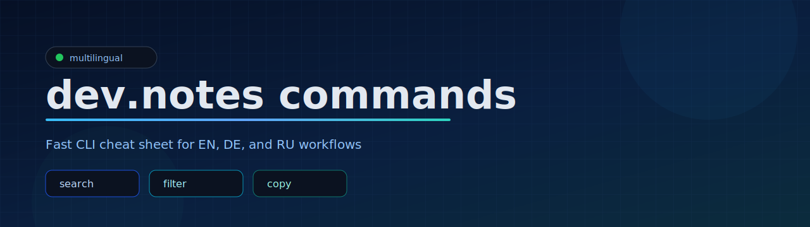

# dev.notes commands




Fast, multilingual command cheat sheet in a single static page.

## Preview


## Roadmap

- [ ] Add command edit mode for local entries
- [ ] Import/export custom commands as JSON
- [ ] Keyboard navigation for command cards
- [ ] Optional compact card layout for small screens
- [ ] Category analytics (count and quick stats)

## Languages

- [English](#english)
- [Deutsch](#deutsch)
- [Русский](#русский)

---

## English

### Overview

Lightweight static web app with searchable command snippets for daily developer/server tasks.

### Features

- 3 built-in languages: English, German, Russian
- Category filters
- Full-text search with highlighted matches
- One-click copy to clipboard
- Add personal commands in browser local storage
- Delete custom local commands

### iPhone App (SwiftUI)

This repository also includes a native iPhone/iPad app.

- Path: `App/DevNotes.xcodeproj`
- Features: language switch (RU/EN/DE), search, category filters, copy command, local custom commands via UserDefaults

Run in Xcode:

1. Open `App/DevNotes.xcodeproj`
2. Select an iPhone simulator or device
3. Press Run (Cmd+R)

### Project Structure

- `index.html` - UI, styles, and app logic
- `commands_EN.json` - English command set
- `commands_DE.json` - German command set
- `commands_RU.json` - Russian command set

### Run Locally

No build step required.

Option 1:

- Open `index.html` directly in your browser

Option 2 (recommended):

```bash
python3 -m http.server 8080
```

Open: `http://localhost:8080`

### JSON Format

```json
{
  "id": 1,
  "cat": "git",
  "name": "basic push",
  "cmd": "git add .\ngit commit -m \"feat: message\"\ngit push origin main",
  "desc": "Short description",
  "params": [["flag", "meaning"]]
}
```

---

## Deutsch

### Ubersicht

Leichte statische Web-App mit durchsuchbaren Befehls-Snippets fur typische Entwickler- und Serveraufgaben.

### Funktionen

- 3 integrierte Sprachen: Englisch, Deutsch, Russisch
- Kategorien-Filter
- Volltextsuche mit Hervorhebung
- Kopieren in die Zwischenablage mit einem Klick
- Eigene Befehle im Browser (localStorage) speichern
- Lokale benutzerdefinierte Befehle loschen

### iPhone-App (SwiftUI)

Dieses Repository enthalt auch eine native iPhone/iPad-App.

- Pfad: `App/DevNotes.xcodeproj`
- Funktionen: Sprachwechsel (RU/EN/DE), Suche, Kategorie-Filter, Kopieren von Befehlen, lokale benutzerdefinierte Befehle via UserDefaults

Start in Xcode:

1. `App/DevNotes.xcodeproj` offnen
2. iPhone-Simulator oder Gerat auswahlen
3. Run (Cmd+R) starten

### Projektstruktur

- `index.html` - UI, Styles und App-Logik
- `commands_EN.json` - Englische Befehle
- `commands_DE.json` - Deutsche Befehle
- `commands_RU.json` - Russische Befehle

### Lokal starten

Kein Build-Schritt erforderlich.

Option 1:

- `index.html` direkt im Browser offnen

Option 2 (empfohlen):

```bash
python3 -m http.server 8080
```

Dann offnen: `http://localhost:8080`

---

## Русский

### Обзор

Легкое статическое веб-приложение с поиском по командам для ежедневных задач разработчика и сервера.

### Возможности

- 3 встроенных языка: английский, немецкий, русский
- Фильтрация по категориям
- Полнотекстовый поиск с подсветкой
- Копирование команды в буфер в один клик
- Добавление своих команд в localStorage браузера
- Удаление локальных пользовательских команд

### Приложение для iPhone (SwiftUI)

В репозитории также есть нативное приложение для iPhone/iPad.

- Путь: `App/DevNotes.xcodeproj`
- Возможности: переключение языков (RU/EN/DE), поиск, фильтры категорий, копирование команд, локальные пользовательские команды через UserDefaults

Запуск в Xcode:

1. Открой `App/DevNotes.xcodeproj`
2. Выбери симулятор iPhone или устройство
3. Нажми Run (Cmd+R)

### Структура проекта

- `index.html` - интерфейс, стили и логика приложения
- `commands_EN.json` - набор команд на английском
- `commands_DE.json` - набор команд на немецком
- `commands_RU.json` - набор команд на русском

### Локальный запуск

Сборка не требуется.

Вариант 1:

- Открыть `index.html` напрямую в браузере

Вариант 2 (рекомендуется):

```bash
python3 -m http.server 8080
```

Открыть: `http://localhost:8080`

---

## License

MIT. See `LICENSE`.
